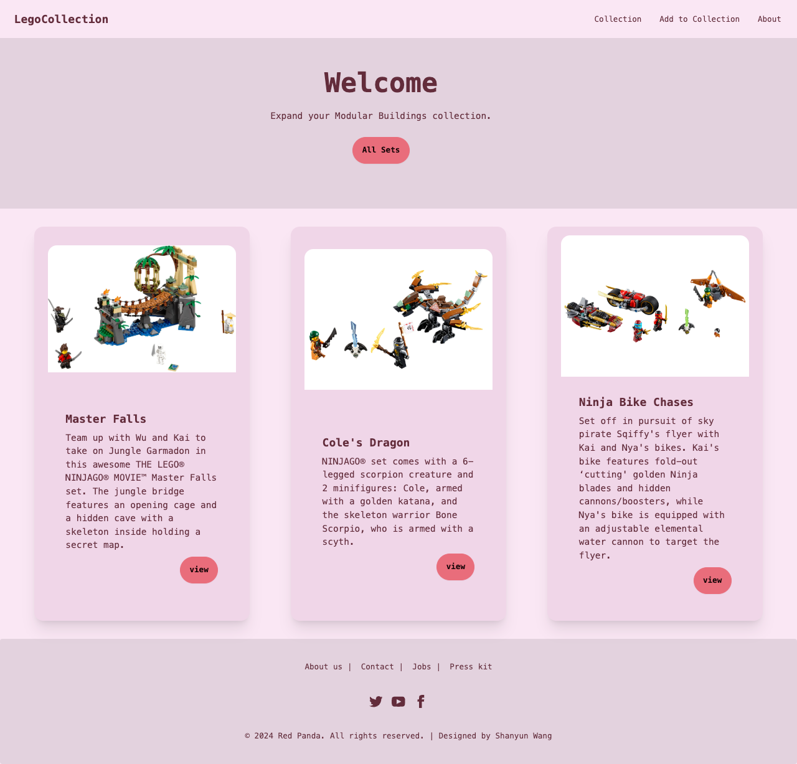
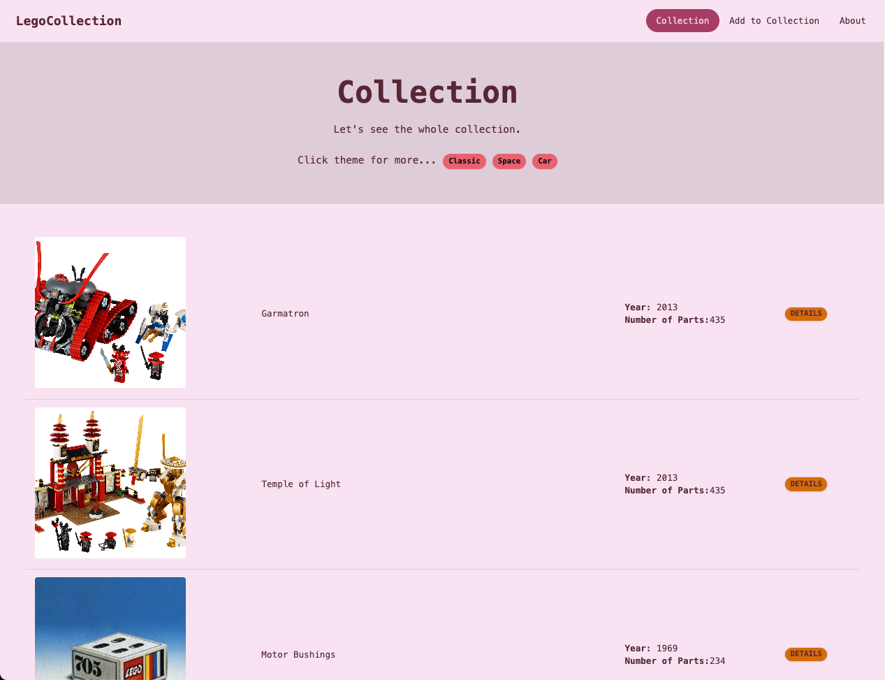
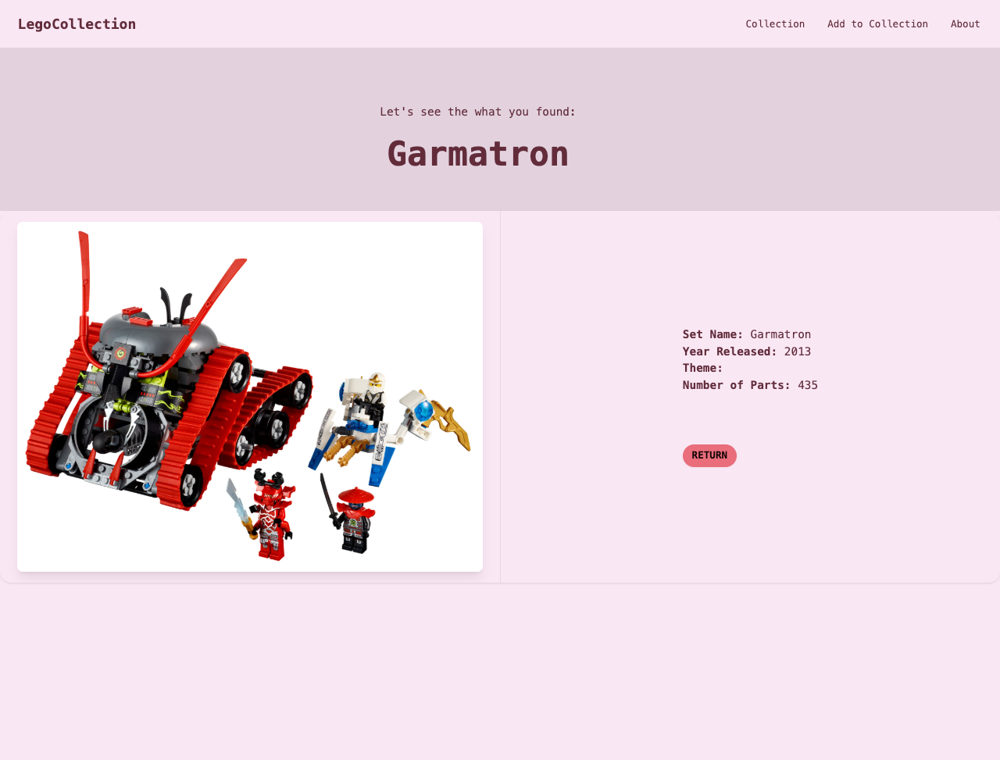
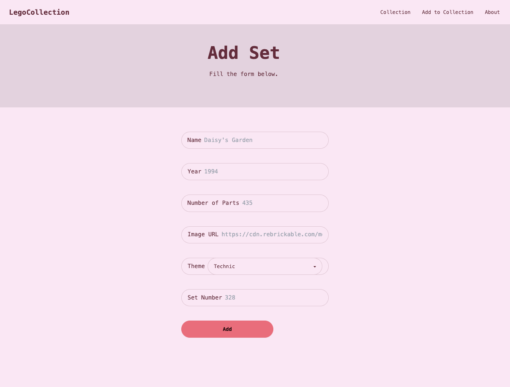

# LegoLib
This is a Lego Collection Library.

## Description

LegoLib is a demo project that showcases a Lego Library where users can browse, add and view details about various Lego sets. The project provides a simple and intuitive interface for expanding your Modular Buildings collection.

## Website Views





## Built With
* [CSS](https://developer.mozilla.org/en-US/docs/Web/CSS)
* [EJS](https://ejs.co/)
* [JavaScript](https://developer.mozilla.org/en-US/docs/Web/JavaScript)

## Getting Started

### Dependencies
* [Node.js](https://nodejs.org/en)
* [Express.js](https://expressjs.com/)
* [Tailwind CSS](https://tailwindcss.com/)

### Installing
1. Clone the repository:
   ```bash
   git clone https://github.com/swang308/LegoLib.git
   ```
2. Navigate to the project directory:
   ```bash
   cd LegoLib
   ```
3. Install the required dependencies:
   ```bash
   npm install
   ```

### Executing program

1. Start the application:
   ```bash
   npm start
   ```
2. Open your browser and navigate to `http://localhost:8080` to see the application in action.

## Help

For any issues or questions, please feel free to open an issue on the [GitHub repository](https://github.com/swang308/LegoLib/issues).

## Authors

Shanyun Wang  
[GitHub Profile](https://github.com/swang308)

## Version History

* 0.2
    * Various bug fixes and optimizations
    * See [commit change](https://github.com/swang308/LegoLib/commits/main)
* 0.1
    * Initial Release

## License

This project is licensed under the MIT License - see the [LICENSE.md](LICENSE.md) file for details

## Acknowledgments

Inspiration, code snippets, etc.
* [Tailwind CSS](https://tailwindcss.com)
* [EJS](https://ejs.co/)
* [Express.js](https://expressjs.com)
* [GitHub README Template](https://gist.github.com/DomPizzie/7a5ff55ffa9081f2de27c315f5018afc)